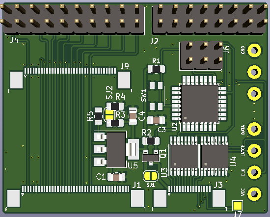
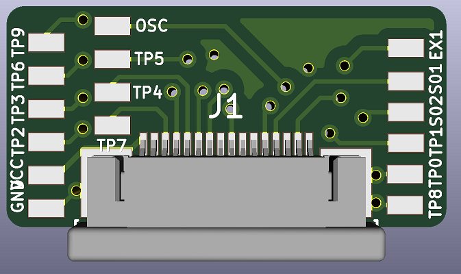

# gbaHD Shield
This is a shield for the [gbaHD project](https://github.com/zwenergy/gbaHD).  

Has the following features.
- Connects via female headers to the Edge board (shield)
- Has a FFC 40 pin connector for GBA LCD connector.
- Has a FFC 16 pin connector for controls with a wire up board.
- Has a ATMEGA328p for using a SNES connector to control the GBA.
- Has a analog switch for GBA power controls (IGR).
- **Both FFC cables need to be opposite side**

## Issues
- Some footprints on shield need to be made bigger for it to be easier to hand solder (X1, U3).
- Breakout board needs to be made bigger.
- FFC connectors need more space.
- Grabs power from the 3.3V rail of the Edge board, ~~this might be an issue~~ so far no issues.

## Contributing
If you wish to contribute, see something wrong or want to add a feature please make a pull request or leave an issue!

## BOM
|Reference	|Value							|
|---------	|--------						|
|C1, C2		|22pF								|
|C3			|100nF							|
|R1			|10K								|
|U1			|SNES 7Pin						|
|U2			|ATMEGA328p-AU					|
|U3			|WAS3157B						|
|X1			|16MHz Crystal SMD-3225		|
|SW1			|XKB-TS-1185EC-C-D-B			|
|J1			|JUSHUO_AFC07-S40FCC-00		|
|J2			|PinHeader 2x08 2.54mm		|
|J3			|JUSHUO_AFC07-S16FCC-00		|
|J4			|PinHeader 2x10 2.54mm		|

## Programming the MCU
In order to program the MCU, you need an arduino to use as ISP.  
Use the following image to wire up an arduino to the board to program it.  
**I would also recomend not programming it while seated in the FPGA board.**
  
After wiring the board, follow this tutorial to flash the bootloader and the sketch to the board.  
[ICSP Tutorial](https://www.arduino.cc/en/pmwiki.php?n=Tutorial/ArduinoISP)

## Images

