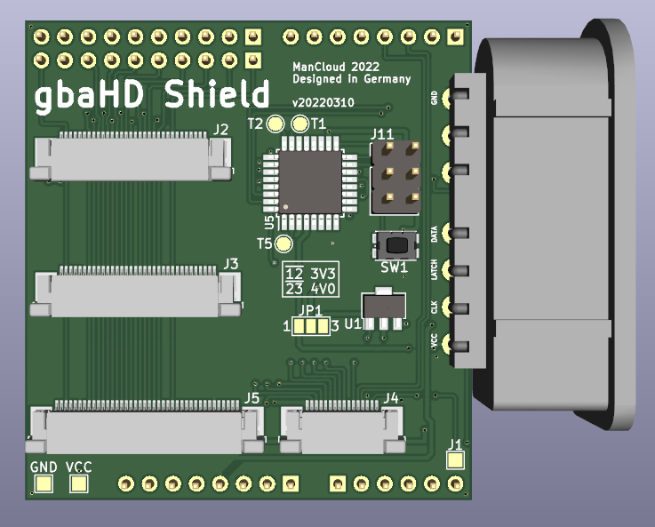
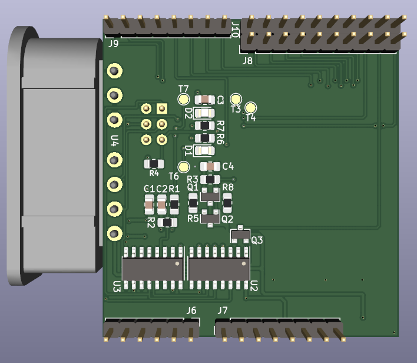
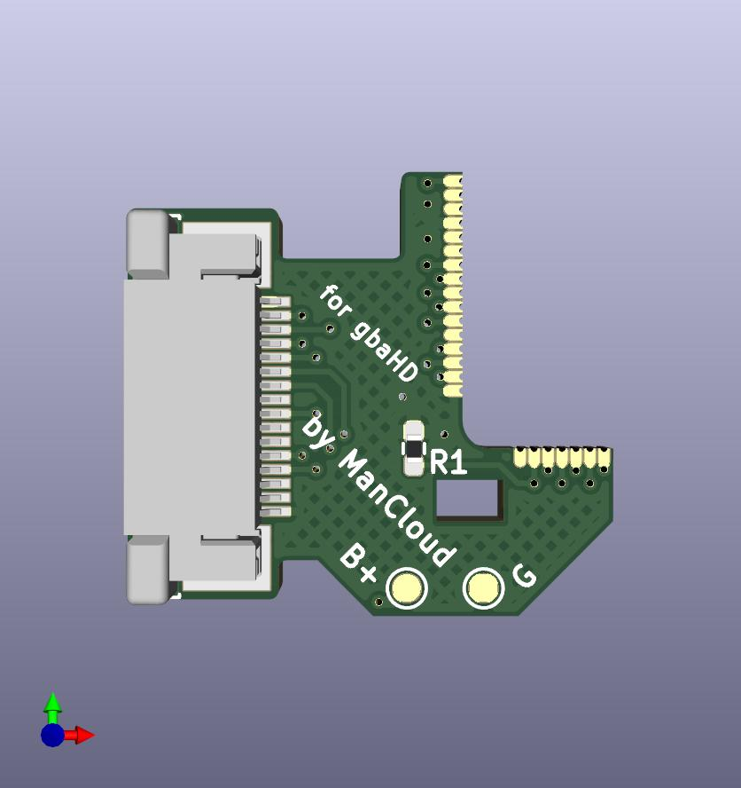
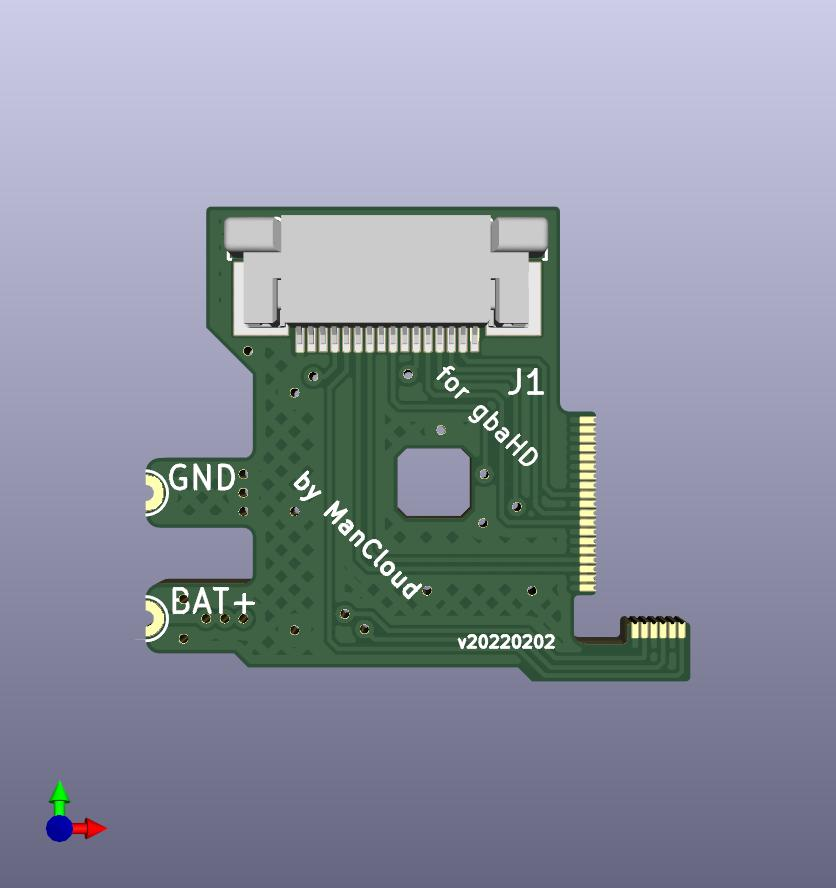

# gbaHD Shield
This is a shield for the [gbaHD project](https://github.com/zwenergy/gbaHD).  

# What is the gbaHD Shield?
The gbaHD Shield is an easy solution to interface with the Spartan Edge Accelerator Board used for the gbaHD Project and the GBA / GBA-SP itself.

It has the following features.
- Connects via female headers to the Edge board (shield)
- Has a FFC 40 pin connector for OGBA LCD connector. Need Type-B Cable (Reverse) vvv=======^^^
- Has a FFC 32 pin connector for OGBA LCD connector. Need Type-B Cable (Reverse) vvv=======^^^
- Has a FFC 34 pin connector for GBA-SP LCD connector. Need Type-A Cable (Direct) vvv=======vvv
- Has a FFC 16 pin connector for controls with a wire up board. Need Type-B Cable (Reverse) vvv=======^^^
- Has a ATMEGA328p / ATMEGA168p / ATMEGA88p for using a SNES connector to control the GBA.
- Has a high-side switch for GBA power controls (IGR).
- Optional Flex-Cable to solder on the the CPU of the GBA and the GBASP
- Unused ATMEGA-Pins are broken out as testpoints on the top and bottom side for future features.

In cooperation with bbsan the featureset of the Shield has been expanded.
The new features are:
- Update of the ATMEGA Firmwre over the ESP32
- Bluetooth-Controller Support
- WebUI
- OTA-Update of the ESP32, ATMEGA and Bitstreams over the WebUI
- Bitstream selection (720p / 1080p) in the WebUI

## Special Thanks
- @zwenergy0 for the gbaHD-Project itself
- @bbsan2k for all the hard work with the ESP32-Side
- @ManCloud for the Shield design itself
- @jotheripper for the awesome cases (https://www.prusaprinters.org/social/170041-jotheripper/about)
- @ricardoquesada for the BluePad-Implementation (https://github.com/ricardoquesada/bluepad32)

## Contributing
If you wish to contribute, see something wrong or want to add a feature please make a pull request or leave an issue!

## BOM
|Reference	|Value    |
|---------	|--------						|
|C1,C3	|100nF - 0805|
|C2	|22u - 0805|
|C4	|47uF - 0805|
|R1	|2.2k - 0805|
|R2,R7,R6	|1k - 0805|
|R3,R4,R8	|10K - 0805|
|R5	|500 - 0805|
|D1	|LED RED - 0805|
|D2	|LED GREEN - 0805|
|U1	|AZ1117R-ADJ - SOT-89-3|
|U2,U3	|74HC595 - SOIC-16|
|U4	|SNES_7PIN|
|U5	|ATmega328P-AU|
|U5-Alternative	|ATmega168P-AU|
|U5-Alternative-Alternative	|ATmega88PA-AU|
|Q1	|SI2301CDS-T1-GE3 - SOT-23|
|Q2,Q3	|2N7002 - SOT-23|
|SW1	|XKB-TS-1185EC-C-D-B|
|J2			|32Pin 0.5 Pitch, bottom contacts|
|J3			|34Pin 0.5 Pitch, bottom contacts|
|J4			|16Pin 0.5 Pitch, bottom contacts|
|J5			|40Pin 0.5 Pitch, bottom contacts|
|J6	|PinHeader 1x6 2.54mm|
|J7,J9	|PinHeader 1x8 2.54mm|
|J8,J10	|PinHeader 1x10 2.54mm|

## Images

Breakout-Board for the OGBA

Breakout-Board for the GBA-SP

Flex-Cable for the GBA

Flex-Cable for the GBA-SP

